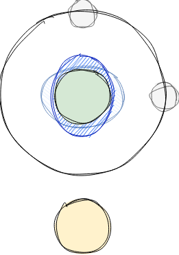

This is a golang port of the perth-3 tide calculation algorithm: https://github.com/asbjorn-christensen/GridWetData/blob/master/fortran_sources/perth3.f

The tool currently works with DTU-16 files from the danish technical university: ftp://ftp.space.dtu.dk/pub/DTU16/OCEAN_TIDE

`./cmd/ascii2dat/main.go` will read a fort.30 file (DTU-16) for constituents and DTU15MSS_2min.mss (DTU-15) for median sea surface height and outputs pre-computed values for all the constituents and mss to a bin file.

`./cmd/test/main.go` can read the created bin file and output the tides for a specific location/time

# Brief introduction to tide calculation
Tides..., how do they work and how can this tool "predict" the tides at a specific location and time. The explanation you got in school about the moon attracting a body of water is just one very small part of the whole truth.

This simplified model would lead to no tides at the poles and enormous tides at the aequator which in reality is not not the case, quite contrary the poles do experience massive tides. The model would also only work if we would have no landmass that reflects or hinders the tidal wave, thats for example the case on the water planet from interstellar, but here on earth not the reality. So here on earth tides are not only created and effected by the gravity of the moon and other celestial bodies but also landmasses and ocean topography which reflect, amplify or dampen the waves. So the better model would be a huge bathtub which is shaken plus some gravity sources always in motion.

*tide heights for the m2 constituent at a specific time[1]*

But how are we able to predict tides in all this chaos? The key is to observe with the help of satellites and tide stations all changes in ocean height for a really long time, subtract, waves, surges and minor changes due to temperature and extract the different curves, frequencies and heights for every point on earth which add up to the curve describing the tide at the given point. This curve is called a **tidal constituent**. Multiple curves which make up the tide curve on a specific point are called **tidal constituents**. These curves all have specific names like P1, O2, M2, K2 and are calculated and distributed by different universities or meterological institutions. The **constituent files** for a specific tide constituent include the amplitude $A$ and the phase angle $\omega$ at time $t_0$ in degree, where $t_0$ is day 0 of the modified julian day, short **MJD** date in **UTC**.

*values of a constituent file, amplitude and phase angle at t=0*

Now a bit of math on how we can determine the height of the tide at a specific point at a specific date.

First of all, every constituent has a specific phase shift, so we have to normalize the curve, to get the height of the shifted sinoid curve at a $(lat,lon)$ in time $t$ from the provided amplitude $A_{c}(lat,lon)$ and angle $\omega_{c}(lat,lon)$ of the constituent $c$ for the frequency $F=1$ we can use the following equation:

$$hcos_{c}(lat,lon) = A_{c}(lat,lon)*cos(\omega_{c}(lat,lon)*\frac{\pi}{180})$$

$$hsin_{c}(lat,lon) = A_{c}(lat,lon)*sin(\omega_{c}(lat,lon)*\frac{\pi}{180})$$

this will give us the amplitude of the cosinus component $hcos_c$ and the amplitude of the sinus component $hsin_c$. With the following equation we can now calculate the height of the phase shifted curve for $(lat, lon)$ and time $t$:

$$height_c(lat,lon, t) = hcos_c(lat,lon)*cos(t)+hsin_c(lat,lon)*sin(t)$$

*for amplitude=2 and phase=90deg hcos (red), hsin(blue) and resulting curve shifted by 90degrees (purple)*

Now things get a bit more complex. With this base equation we now get the $height$ of a constituent $_c$ on a specific location $(lat,lon)$ at the time $t$ with a assumed frequency $F$ of 1, leading to a period of $2\pi$ julian days. Unfortunately every tide constituent has it's own frequency which needs to be known. To make things even more complex variations of the relative positions of the earth, moon or sun at a specific time $t$ will change the frequency and amplitude of the constituent. These variations also need to be taken into account. The variations which need to be taken into account and how to calculate these variations are known and defined for every constituent (P1, O2, K2, ...) and are called in our case **argument** of the constituent $ARG_c(t)$ and **nodal corrections** $U_c(t)$ and $F_c(t)$.

the argument $ARG_c$ and nodal correction $U_c$ effect the frequency of the constituents curve, the nodal correction $F_c$  effect its amplitude. You can take a look in the code how these values are calculated for each known constituent and which celestial bodies and its position they take into account.

With all of these equations and information we now can formulate the equation to get the calculated height $h(lat,lon,t)$ for a specific location and time for all known constituents $c$

$$h(lat,lon, t) = \sum_{c=P1,O1,...}{hcos_c(lat,lon)*F(t)*cos(ARG_c(t)+U_c(t)*\frac{\pi}{180})+hsin_c(lat,lon)*F(t)*sin(ARG_c(t)+U_c(t)*\frac{\pi}{180})}$$ 

Ok, now to get the tide height for display, for this we need to know some oceanographic datums, in our case the **LAT** the lat is the lowest astronomical tide, meaning the lowest a tide can get only depending on the tide equation, don't taking local phenomenon like storm surges, wind, etc into account (HAT is the highest astronomical tide). Maps for navigation typically denote all depths relative to the LAT, meaning if the tide is at its lowest possible and the map is blue at your position you still have water under the keel :D. To calculate the $LAT(lat,lon)$ you need to find the lowest value of $h(lat,lon)$ over a time interval of ~19 years. Why 19years?, this has to do with the movement of celestial bodies, the chances are high, that within this 19years the bodies are aligned to create the HAT and LAT.

$$LAT(lat,lon) = min_{t=0}^{t<19y}{(h(lat,lon, t))}$$

All tide heights are also displayed relative to the LAT, so the final equation to get the final tide height relative to lat $h_{lat}$ is
$$h_{lat}(lan,lon,t) = h(lat,lon,t)-LAT(lat,lon)$$

The explanation for computation of the node corrections and arguments will follow :)

# References
* [1] https://www.space.dtu.dk/english/research/scientific_data_and_models/global_ocean_tide_model
